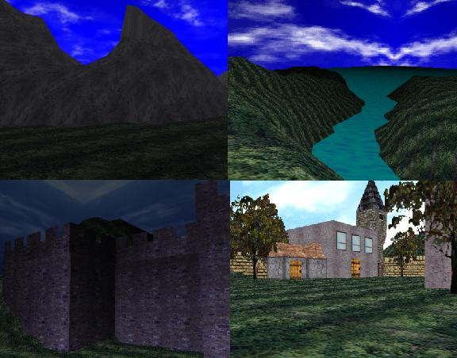



## A1 DTA \- 3D engine code

### Description

DTA supports high collision detection , maps , models , fog and light effects and more

I included only one map and no models with this code but you can make your own maps and models

** Note : the picture is from the old version the new version is much better
 
### More Info
 

             |
---                |---
**Submitted On**   |2002-05-25 15:53:08
**By**             |[shlomi baesa](https://github.com/Planet-Source-Code/PSCIndex/blob/master/ByAuthor/shlomi-baesa.md)
**Level**          |Advanced
**User Rating**    |4.9 (64 globes from 13 users)
**Compatibility**  |VB 5\.0, VB 6\.0
**Category**       |[DirectX](https://github.com/Planet-Source-Code/PSCIndex/blob/master/ByCategory/directx__1-44.md)
**World**          |[Visual Basic](https://github.com/Planet-Source-Code/PSCIndex/blob/master/ByWorld/visual-basic.md)
**Archive File**   |[DTA\_\-\_3D\_e868445252002\.zip](https://github.com/Planet-Source-Code/shlomi-baesa-a1-dta-3d-engine-code__1-35084/archive/master.zip)

